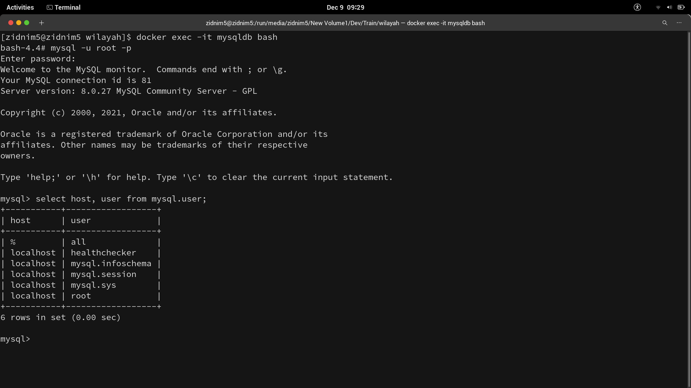
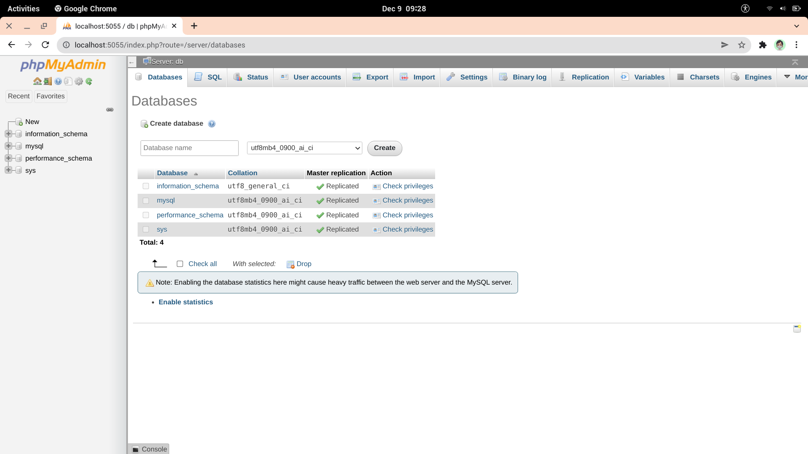

# MYSQL
Open terminal & run command below :

```
docker run --detach --name=[name_container] \
--env="MYSQL_ROOT_PASSWORD=password" \
--restart unless-stopped \
-p 6603:3306 \
-volume /root/docker/[name_container]/conf.d:/etc/[name_container]/conf.d \
-d mysql/mysql-server:latest
```
- --name : set the name of the container.
- --env : set the database root password.
- -p : 6603 port is used by default. 
- -v : This parameter is related to the Docker Volume feature. 
- -d : I will run detached mode(background mode). 

Sometimes you need to create all user for all host :
```
docker exec -it [name_container_mysql] bash
```
```
mysql -u root -p
```
```
CREATE USER '[username]'@'%' IDENTIFIED BY 'password';
```
```
grant [username] on *.* to '[username]'@'%';
```
The above command is create a new user account for mysql which can be accessed from anywhere host "%".
```
select host, user from mysql.user;
```


It has to contain a line with your database user and '%' to works (% means "every IP addresses are allowed").


# PHPMYADMIN

Open terminal & run command below :

```
docker run --name phpmyadmin \
--restart unless-stopped \
-d --link [name_of_mysql_container]:db \
-p 8081:80 phpmyadmin/phpmyadmin
```
Open http://localhost:8081 on your browser. 



# Documentation

- Official mysql: https://dev.mysql.com/doc/mysql-installation-excerpt/8.0/en/docker-mysql-getting-started.html
- Official phpmyadmin: https://hub.docker.com/r/phpmyadmin/phpmyadmin
- Issue not allowed connect: https://github.com/docker-library/mysql/issues/275
- https://migueldoctor.medium.com/run-mysql-phpmyadmin-locally-in-3-steps-using-docker-74eb735fa1fc
